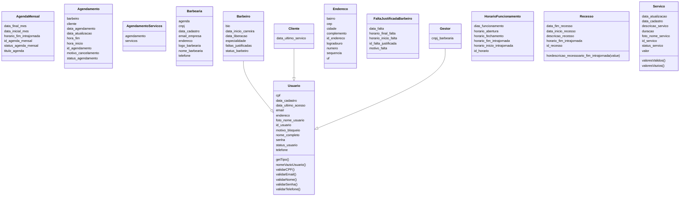

```mermaid
classDiagram
  class AgendaMensal {
    data_final_mes
    data_inicial_mes
    horario_fim_intrajornada
    id_agenda_mensal
    status_agenda_mensal
    titulo_agenda
  }
  class Agendamento {
    barbeiro
    cliente
    data_agendamento
    data_atualizacao
    hora_fim
    hora_inicio
    id_agendamento
    motivo_cancelamento
    status_agendamento
  }
  class AgendamentoServicos {
    agendamento
    servicos
  }
  class Barbearia {
    agenda
    cnpj
    data_cadastro
    email_empresa
    endereco
    logo_barbearia
    nome_barbearia
    telefone
  }
  class Barbeiro {
    bio
    data_inicio_carreira
    data_liberacao
    especialidade
    faltas_justificadas
    status_barbeiro
  }
  class Cliente {
    data_ultimo_servico
  }
  class Endereco {
    bairro
    cep
    cidade
    complemento
    id_endereco
    logradouro
    numero
    sequencia
    uf
  }
  class FaltaJustificadaBarbeiro {
    data_falta
    horario_final_falta
    horario_inicio_falta
    id_falta_justificada
    motivo_falta
  }
  class Gestor {
    cnpj_barbearia
  }
  class HorarioFuncionamento {
    dias_funcionamento
    horario_abertura
    horario_fechamento
    horario_fim_intrajornada
    horario_inicio_intrajornada
    id_horario
  }
  class Recesso {
    data_fim_recesso
    data_inicio_recesso
    descricao_recesso
    horario_fim_intrajornada
    id_recesso
    hordescricao_recessoario_fim_intrajornada(value)
  }
  class Servico {
    data_atualizacao
    data_cadastro
    descricao_servico
    duracao
    foto_nome_servico
    id_servico
    status_servico
    valor
    valoresValidos()
    valoresVazios()
  }
  class Usuario {
    cpf
    data_cadastro
    data_ultimo_acesso
    email
    endereco
    foto_nome_usuario
    id_usuario
    motivo_bloqueio
    nome_completo
    senha
    status_usuario
    telefone
    getTipo()
    nomeVazioUsuario()
    validarCPF()
    validarEmail()
    validarNome()
    validarSenha()
    validarTelefone()
  }
  Barbeiro --|> Usuario
  Cliente --|> Usuario
  Gestor --|> Usuario

```